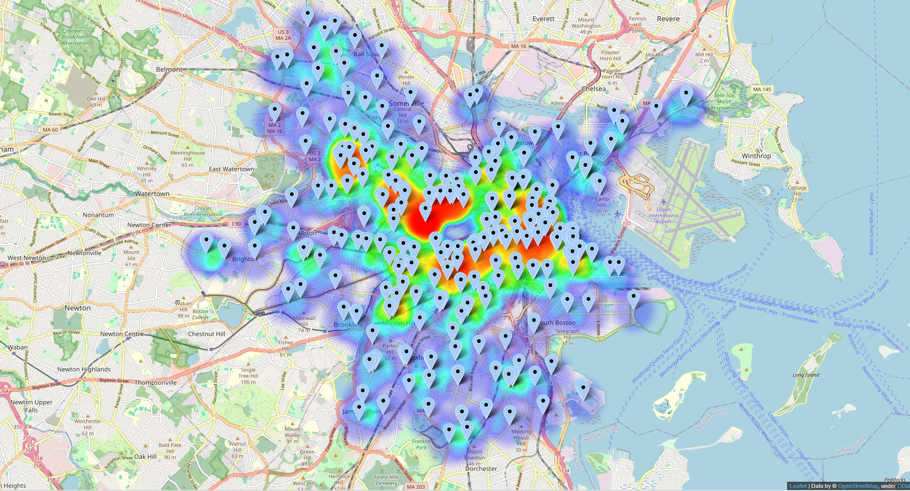

# Big Data: Hubway ETL-Workflow using Airflow

This is my final assignment for the Big Data course at DHBW Stuttgart where I created an ETL-Workflow with Airflow utilizing the open Hubway dataset from Kaggle (https://www.kaggle.com/datasets/acmeyer/hubway-data) to create an Excel KPI dashboard with PySpark as well as 
a heatmap illustrating dense regions/stations for Bluebike bike renting in Boston.



## Project structure
The `src` folder contains the three Python files used for the workflow. The `hubway.py` file defines the DAG. The `create_kpi_excel.py` contains the PySpark logic for extracting meaningful KPI data and creating the Excel file. The `create_loc_heatmap.py` is used to create a heatmap showing the most used start stations for renting a bike.

the `results` folder contains the two files (Excel KPI and heatmap.html) that were produced after successfully running the workflow with Airflow.

## Installation
To build and run the two different docker containers called `airflow` and `hadoop` do:

```bash
  docker-compose up --build
```

To start the Hadoop services do the following: 

```bash
  docker exec -it hadoop bash
  sudo su hadoop
  cd 
  start-all.sh
```

The `airflow` container is based on the `marcelmittelstaedt/airflow:latest` image and extends it by some custom libraries and tools that are used for the workflow.

See the Airflow-Workflows on "xxx.xxx.xxx.xxx:8080" in your local web browser.

## Results
The Heatmap `heatmap.html` can be opened inside your local web browser. It shows different start stations and common areas of high renting volume. What I found out during exploration is, that station with ID=67 is used very heavy. It is propably used to cross the river over the so called Harvard Bridge. Also it is near the MIT campus, so students are frequent customers which can also be reasoned by the age share results in the KPI. The Excel KPI named `hubway_kpi_result.xlsx` contains different Sheets for the different KPI's. The following sheets are available:


- **Avg Trip Duration**: Average duration of trips.
- **Avg Trip Distance**: Average distance of trips.
- **Usage Share Gender**: Distribution of usage by gender.
- **Usage Share Age Group**: Distribution of usage by age group.
- **Top Bikes**: Top 10 most frequently used bikes.
- **Top Start Stations**: Top 10 most used start stations.
- **Top End Stations**: Top 10 most used end stations.
- **Usage Share Per Slot**: Usage distribution across the following time slots: 0-6, 6-12, 12-18, 18-24.

For every sheet the data is computed per month. For `Avg Trip Duration` it is computed per year and month. The top stations are shown by their id, so it is easier to locate them on the heatmap.

## How does the ETL-Workflow work?
The `hubway.py` defines the DAG. Kaggle Hubway data is downloaded as a `.zip` file. The files are extracted. The `home/airflow/hubway` folder gets created and is used for the raw files. Inside this folder a `csv` folder is created which will contain the relevant `.csv` files for further processing. The CSV files are concatenated into one file. This is our raw file which will be placed in the Hadoop HDFS folder (partitioned by current year and month). The Hubway dataset has no need for an extra cleansing stage. Some `birthyear` data is missing, but can be nulled when reading in the data with PySpark. The final stage are the two scripts which create the Excel-KPI data using PySpark and the Heatmap using Folium. The resulting files are stored inside the `/home/airflow/airflow/python` folder.